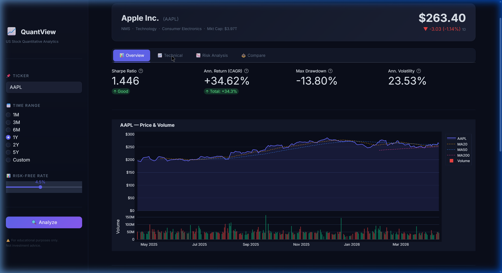
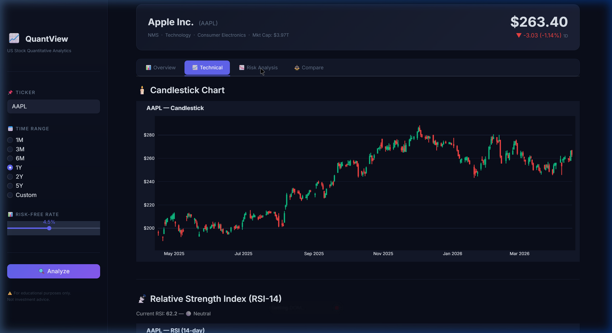
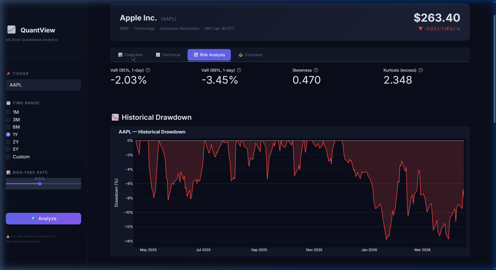

# 📈 QuantView — US Stock Quantitative Analytics


> An introductory quantitative finance web app — input any US stock ticker, select a time window, and get real-time metrics, technical indicators, and interactive charts.

---

## 📸 Screenshots

### 📊 Overview — KPI Cards + Price & Volume Chart


### 📈 Technical — Candlestick + RSI + Bollinger Bands


### 📉 Risk Analysis — Drawdown + Returns Distribution


---

## ✨ Features

| Tab | Content |
|-----|---------|
| **📊 Overview** | Sharpe Ratio, CAGR, Max Drawdown, Volatility, Beta, Alpha, Sortino, Calmar · Price & Volume chart · Rolling Sharpe (63-day) |
| **📈 Technical** | Candlestick chart · RSI-14 with overbought/oversold zones · Bollinger Bands (SMA-20, ±2σ) |
| **📉 Risk Analysis** | VaR (95% & 99%) · Skewness & Kurtosis · Historical Drawdown chart · Returns Distribution with Normal fit · Full metrics table with formulas |
| **⚖️ Compare** | Normalized return chart for up to 3 tickers · Side-by-side metrics table |

---

## 📐 Quantitative Metrics

### Sharpe Ratio
$$SR = \frac{R_p - R_f}{\sigma_p}$$

- $R_p$ = Annualized portfolio return (CAGR)  
- $R_f$ = Risk-free rate (configurable, default **4.5%** ≈ US 10Y Treasury)  
- $\sigma_p$ = Annualized volatility ($\sigma_{daily} \times \sqrt{252}$)

### Sortino Ratio
$$Sortino = \frac{R_p - R_f}{\sigma_{downside}}$$

Only penalises **downside** deviation — a fairer measure for asymmetric return distributions.

### Maximum Drawdown
$$MaxDD = \min\left(\frac{P_t}{\max(P_0,\ldots,P_t)} - 1\right)$$

### Beta & Jensen's Alpha (CAPM)
$$\beta = \frac{Cov(R_s,\ R_m)}{Var(R_m)} \qquad \alpha = R_s - \left[R_f + \beta(R_m - R_f)\right]$$

Benchmark: **SPY** (S&P 500 ETF)

### Value at Risk (Historical, 95%)
$$VaR_{95\%} = 5\text{th percentile of daily return distribution}$$

### Calmar Ratio
$$Calmar = \frac{R_{ann}}{|MaxDD|}$$

---

## 🚀 Quick Start

### Prerequisites
- Python 3.10+
- pip

### Install & Run

```bash
# 1. Clone the repository
git clone https://github.com/MightyAtria/test1111.git
cd test1111

# 2. (Recommended) Create a virtual environment
python -m venv .venv
.venv\Scripts\activate        # Windows
# source .venv/bin/activate   # macOS / Linux

# 3. Install dependencies
pip install -r requirements.txt

# 4. Launch the app
streamlit run app.py
```

Opens at **http://localhost:8501** automatically.

---

## 🖱️ How to Use

1. **Enter a ticker** in the sidebar (e.g. `AAPL`, `TSLA`, `NVDA`, `SPY`, `QQQ`)
2. **Choose a time range**: `1M` / `3M` / `6M` / `1Y` / `2Y` / `5Y` or Custom dates
3. **Adjust the Risk-Free Rate** slider (default 4.5%)
4. Click **🔍 Analyze**
5. Explore the four tabs freely — all charts are interactive (zoom, hover, pan)

---

## 🗂️ Project Structure

```
stock-analysis-app/
├── app.py                   # Streamlit entry point & UI layout
├── src/
│   ├── data_fetcher.py      # yfinance data retrieval with @st.cache_data
│   ├── metrics.py           # All quantitative calculations
│   └── charts.py            # Plotly chart builders (8 chart types)
├── .streamlit/
│   └── config.toml          # Dark theme + server config
├── deploy/
│   └── nginx.conf           # Production Nginx reverse proxy config
├── docs/
│   ├── screenshot_overview.png
│   ├── screenshot_technical.png
│   └── screenshot_risk.png
├── requirements.txt
├── .gitignore
└── README.md
```

---

## 🌐 Self-Hosted Deployment

Run the app publicly on your own server with Nginx + Let's Encrypt HTTPS.

### 1. Background service

**Windows (NSSM):**
```powershell
winget install nssm
nssm install QuantView "C:\Python311\Scripts\streamlit.exe" `
    "run C:\path\to\app.py --server.port 8501 --server.headless true"
nssm start QuantView
```

**Linux (systemd):**
```bash
# /etc/systemd/system/quantview.service
[Unit]
Description=QuantView Streamlit App
After=network.target

[Service]
User=ubuntu
WorkingDirectory=/home/ubuntu/test1111
ExecStart=/home/ubuntu/.venv/bin/streamlit run app.py \
          --server.port 8501 --server.headless true
Restart=always

[Install]
WantedBy=multi-user.target
```
```bash
sudo systemctl daemon-reload && sudo systemctl enable --now quantview
```

### 2. Nginx reverse proxy

Use the ready-made config in [`deploy/nginx.conf`](deploy/nginx.conf).  
Key settings included: HTTP→HTTPS redirect, WebSocket upgrade headers, keep-alive timeout.

### 3. HTTPS (Let's Encrypt)
```bash
sudo apt install certbot python3-certbot-nginx
sudo certbot --nginx -d stock.yourdomain.com
```

### 4. Router port forwarding
Forward **80 / 443** → machine LAN IP → port **80**.  
Set DNS A record → router public IP. Assign a **static LAN IP** to the machine.

```
Browser  →  Router (public IP :443)  →  Nginx (:80, TLS)  →  Streamlit (:8501)
```

---

## 🛠️ Tech Stack

| Layer | Library |
|-------|---------|
| UI Framework | [Streamlit](https://streamlit.io) |
| Market Data | [yfinance](https://github.com/ranaroussi/yfinance) |
| Data Processing | pandas · numpy |
| Visualisation | [Plotly](https://plotly.com) |
| Statistics | scipy |
| Deployment | Nginx + Let's Encrypt |

---

## ⚠️ Disclaimer

> This project is built **for educational purposes only** as part of a school assignment on introductory quantitative finance.  
> It does **not** constitute investment advice. All data is sourced from Yahoo Finance via `yfinance` and may be delayed or inaccurate.  
> **Never make real financial decisions based on this tool.**

---

## 📄 License

[MIT License](LICENSE) — free to use, modify, and distribute.
